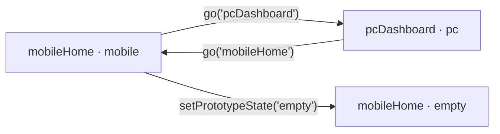

# Prototype Core 项目评估报告

## 1. 核心摘要

### 1.1 一句话总判断

**结论：项目已经形成“基于 Vue 组件注册的原型评审运行时”，但还不是“把页面文件放进指定目录即可自动加载”的 View 文件路由框架。** 消费者需要显式导入页面组件，并在 `PrototypeProductDefinition.pages` 中注册；内核随后统一提供移动端/PC 外壳、状态、流程、批注、页面描述和协作能力。

### 1.2 对三个问题的直接回答

| 问题 | 当前答案 | 证据 |
| --- | --- | --- |
| 如何标注页面类型？ | 在页面元数据中写 `platform: 'mobile'` 或 `platform: 'pc'`；移动端页面可额外用 `hasTabBar: true` 进入内核 TabBar。 | `src/types/prototype.ts`、`examples/basic/src/product.ts` |
| 页面交互逻辑怎么写？ | 页面内部使用普通 Vue 事件；通过 `usePrototypeContext()` 取得 `go`、`goTab`、`setPrototypeState`，完成跨页、Tab 和页面状态切换。流程展示关系另写在 `product.flows`。 | `src/core/productAdapter.ts`、两个示例页面 |
| 能否自由跳转？ | 已注册页面之间可以跨移动端/PC 直接 `go(screenId)`；但目前没有 Vue Router 式 URL、历史栈、参数、守卫与目标校验。 | `src/prototype/usePrototype.ts` |

### 1.3 能否生成可批注、注释的原型？

**可以。** 注册组件会被 `ScreenRenderer` 放入统一画布；批注按 `screenId + stateId` 隔离，并以画布百分比 `x/y` 保存，所以移动端与 PC 页面都能落点、编辑、拖动和同步。这里的“生成”是把业务 Vue 页面装入评审壳，不是从描述自动生成页面。

### 1.4 最值得关注的问题

**页面接入契约已经成立，但“指定位置自动发现”“安全导航”和“类型安全页面 ID”尚未成立。** `ScreenMeta.componentPath` 虽然存在，当前渲染器只读取 `component`；因此页面文件所在目录只是项目约定，不会触发自动加载。

## 2. 分析前提

- 类型：自家产品审视。
- 范围：静态检查公共类型、产品适配器、运行时、渲染器、批注链路和 `examples/basic`。
- 未启动 UI；本报告不评价最终视觉质量。
- 需要补充页面截图：交互模式主画布、全图模式、流程模式、批注编辑弹窗。

## 3. 战略层：产品定位

**观察事实：内核的价值不是替业务写页面，而是把任意业务 Vue 页面装入统一评审环境。** 依赖方向是“产品依赖内核”，业务页面、状态与资源由消费者注入。


## 4. 范围层：现有能力边界

| 能力 | 状态 | 说明 |
| --- | --- | --- |
| Vue 页面组件注册 | 已实现 | `pages: ScreenMeta[]` 接收组件及元数据。 |
| 移动端/PC 类型 | 已实现 | `ScreenPlatform = 'mobile' \| 'pc'`。 |
| 页面状态 | 已实现 | `states[screenId]` 注册状态，页面调用 `setPrototypeState`。 |
| 页面跳转 | 已实现（轻量） | `go` 和 `goTab` 直接切换当前 `screenId`。 |
| 页面流程图 | 已实现 | `flows[].rows` 用 `screenId/stateId` 组织流程节点。 |
| 批注与页面描述 | 已实现 | 按页面/状态作用域存储，本地缓存或 Gitee 协作。 |
| 目录自动扫描 | 未实现 | 没有 `import.meta.glob` 或等价注册器。 |
| Vue Router 能力 | 未实现 | 无 URL、前进后退、参数、守卫、404。 |
| `componentPath` 动态加载 | 未实现 | 字段存在，但 `ScreenRenderer` 只渲染 `component`。 |

## 5. 结构层：接入与交互链路

### 5.1 页面注册

```ts
import { Home, Monitor } from '@lucide/vue'
import MobileHome from './screens/MobileHome.vue'
import PcDashboard from './screens/PcDashboard.vue'

export const product = {
  pages: [
    {
      id: 'mobileHome',
      platform: 'mobile',
      code: 'M1',
      title: '移动端首页',
      subtitle: '首页',
      icon: Home,
      component: MobileHome,
      hasTabBar: true,
    },
    {
      id: 'pcDashboard',
      platform: 'pc',
      code: 'PC1',
      title: 'PC 工作台',
      subtitle: '工作台',
      icon: Monitor,
      component: PcDashboard,
    },
  ],
  // copy、states、flows 仍须提供
}
```

**判断：**“写到指定位置”本身不够；必须完成“导入组件 + 添加 `pages` 元数据”。目录可以由消费者自行约定，例如 `src/screens/`，但内核目前不读取目录。

### 5.2 页面内交互

```vue
<script setup lang="ts">
import { usePrototypeContext } from '@marktowin/prototype-core'

const { go, goTab, setPrototypeState } = usePrototypeContext()
</script>

<template>
  <button @click="go('pcDashboard')">去 PC 工作台</button>
  <button @click="setPrototypeState('empty')">切为空状态</button>
</template>
```

- 普通显隐、弹窗、表单等交互仍按 Vue 组件本地状态写。
- 跨页面用 `go(screenId)`。
- 底部 Tab 语义用 `goTab(screenId)`；当前它本质上仍会调用 `go`。
- 同页原型状态用 `setPrototypeState(stateId)`，跨页预设状态可用 `setPrototypeState(screenId, stateId)`。
- `flows` 是“评审流程的结构数据”，不会自动驱动业务页面点击；业务点击与流程图当前是两套需要保持一致的数据。

### 5.3 跳转拓扑



**限制：** `go(id)` 直接写入当前 ID。若传入不存在的 ID，显示元数据会回退到首个页面，但当前页面 ID、状态和批注作用域仍可能保持错误值，属于“表面回退、内部状态不一致”的风险。

## 6. 框架层：端型与渲染机制

需要补充页面截图：移动端画布、PC 画布。

| 项目 | mobile | pc |
| --- | --- | --- |
| 标记 | `platform: 'mobile'` | `platform: 'pc'` |
| 评审外壳 | 手机框、状态栏，可选 TabBar | 1920×1080 基准桌面画布 |
| 流程节点基准 | 393×902 | 640×360 缩略节点 |
| 业务组件 | 同一个 `ScreenRenderer` 渲染 | 同一个 `ScreenRenderer` 渲染 |
| 批注 | 支持 | 支持 |

`ScreenRenderer` 只是动态 `<component :is="screen.component">`，所以它更接近“View 容器/宿主”，而不是具备路由生命周期的页面框架。

## 7. 表现层：评审体验判断

**合理推测：**移动/PC 双外壳、全图和流程模式已经足以支持产品评审会议中的“单页查看—全局盘点—流程串联”。但缺少实际运行截图，本次不对比例适配、滚动、遮挡和批注落点的视觉准确性下最终结论。

## 8. 后台与暗线：数据与协作

批注数据结构包含 `screenId`、可选 `stateId`、百分比 `x/y` 及描述字段。作用域规则为：

```text
无状态页面：screenId
有状态页面：screenId__stateId
```

本地模式写入浏览器缓存；配置协作运行参数后，可按项目与代码分支同步到 Gitee。它适合原型评审，但浏览器端 Token 配置不应被视为生产级秘密保护。

## 9. 综合诊断与建议

### 9.1 成熟度判断

**当前成熟度：可作为“显式注册式原型评审框架”使用。** 现有最小示例已证明移动端、PC、跨端跳转、状态和流程契约能串起来。

### 9.2 推荐的准确称呼

- 推荐：`Vue 原型评审运行时`、`显式注册式页面框架`、`原型评审内核`。
- 暂不建议：`文件路由框架`、`页面放入目录即可自动加载的脚手架`。

### 9.3 下一版本只改一个点

**建议先增强注册契约校验，而不是先做自动扫描。** 在挂载时校验页面 ID 唯一、`component` 存在、流程/状态/跳转目标有效，并让无效 `go` 明确报错。原因是当前接入已经够轻，真正影响规模化使用的是字符串 ID 错误会静默产生状态不一致；自动扫描只是减少几行注册代码，却会引入命名、元数据和懒加载约定。

若你的明确目标是“新增 `.vue` 文件即自动加载”，再单独设计基于 `import.meta.glob` 的消费者侧注册器会更合适，不建议让公开内核猜测消费者目录结构。

## 10. 资料来源与验证清单

### 10.1 代码来源

- `HANDOFF.md`
- `README.md`
- `src/types/prototype.ts`
- `src/core/productAdapter.ts`
- `src/core/contextBridge.ts`
- `src/screens/ScreenRenderer.vue`
- `src/prototype/usePrototype.ts`
- `src/App.vue`
- `examples/basic/src/product.ts`
- `examples/basic/src/screens/MobileHome.vue`
- `examples/basic/src/screens/PcDashboard.vue`

### 10.2 需要验证

- 实际启动示例，验证移动端和 PC 页面在交互、全图、流程三种模式下的视觉比例。
- 分别在有/无状态页面添加批注，验证切换状态后的隔离效果。
- 调用不存在的 `screenId`，确认当前回退与批注作用域不一致的用户可见影响。
- 在首个真实消费者中用 npm 包安装，而非 workspace 链接，完成端到端接入回归。
